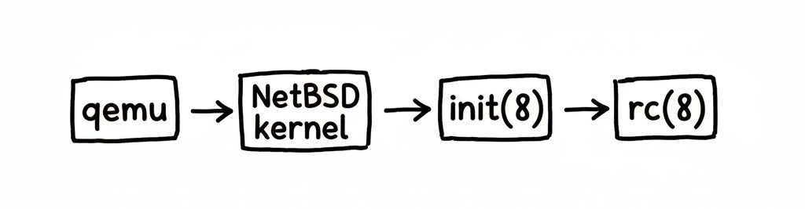

<div align="center" markdown="1">


**smolBSD**

build your own minimal BSD UNIX system


</div>

# What is smolBSD?

smolBSD helps you create a minimal _NetBSD_ 🚩 based _BSD UNIX_ virtual machine that's able to boot and start a service in a couple milliseconds.  
* No prior _NetBSD_ installation is required, a _microvm_ can be created and started from any _NetBSD_, _GNU/Linux_, _macOS_ system and probably more.
* [PVH][4] boot and various optimizations enable _NetBSD/amd64_ and _NetBSD/i386_ to directly boot [QEMU][8] or [Firecracker][9] in about 10 **milliseconds** on 2025 mid-end x86 CPUs. 

<div align="center" markdown="1">

**microvm typical boot process**



</div>

# Usage

## Requirements

- A _GNU/Linux_, _NetBSD_ or _macOS_ operating system (might work on more systems, but not CPU accelerated)
- The following tools installed
  - `curl`
  - `jq` (for `docker2svc.sh`)
  - `git`
  - `bmake` if running on _Linux_ or _macOS_, `make` on _NetBSD_
  - `qemu-system-x86_64`, `qemu-system-i386` or `qemu-system-aarch64` depending on destination architecture
  - `sudo` or `doas`
  - `nm` (not used / functional on _macOS_)
  - `bsdtar` on Linux (install with `libarchive-tools` on Debian and derivatives, `libarchive` on Arch)
  - `sgdisk` on Linux for GPT boot
  - `socat` for control socket (optional)
- A x86 VT-capable, or ARM64 CPU is recommended

### Lazy copypasta

Debian, Ubuntu and the like
```sh
$ sudo apt install curl jq git bmake qemu-system-x86_64 sudo binutils libarchive-tools gdisk socat
```

macOS
```sh
$ brew install curl jq git bmake qemu binutils libarchive
```

## Quickstart

### Create a _smolBSD_ image using a _Dockerfile_

📄 `dockerfiles/Dockerfile.caddy`:
```dockerfile
# Mandatory, either comma separated base sets (here base and etc)
# or base image name i.e. base-amd64.img
FROM base,etc

# Mandatory, service name
LABEL smolbsd.service=caddy
# Optional image minimization to actual content
LABEL smolbsd.minimize=y
# Dockerfile doesn't support port mapping
LABEL smolbsd.publish="8881:8880"

RUN pkgin up && pkgin -y in caddy

EXPOSE 8880

CMD ["caddy", "respond", "-l", ":8880"]
```
⚙️ Build:
```sh
host$ ./docker2svc.sh dockerfiles/Dockerfile.caddy
```
🚀 Run:
```sh
host$ ./startnb.sh -f etc/caddy.conf
```
✅ Test:
```sh
host$ curl -I 127.0.0.1:8881
HTTP/1.1 200 OK
Server: Caddy
Date: Fri, 23 Jan 2026 18:20:42 GMT
```

# Deep dive

## Project structure

- `dockerfiles/` _smolBSD_ services `Dockerfile` examples
- `Makefile` the entrypoint for image creation, called by `[b]make`
- `mkimg.sh` image creation script, should not be called directly
- `startnb.sh` starts a _NetBSD_ virtual machine using `qemu-system-x86_64` or `qemu-system-aarch64`
- `sets/` contains _NetBSD_ "sets" by architecture, i.e. `amd64/base.tgz`, `evbarm-aarch64/rescue.tgz`...
- `pkgs/` holds optional packages to add to a microvm, it has the same format as `sets`.

A `service` is the base unit of a _smolBSD_ microvm, it holds the necesary pieces to build a _BSD_ system from scratch.  
- `service` structure:

```sh
service
├── base
│   ├── etc
│   │   └── rc
│   ├── postinst
│   │   └── dostuff.sh
│   ├── options.mk       # Service-specific defaults
│   └── own.mk           # User-specific overrides (not in git)
├── common
│   └── basicrc
└── rescue
    └── etc
        └── rc
```
A microvm is seen as a "service", for each one:

- There **COULD** be a `postinst/anything.sh` which will be executed by `mkimg.sh` at the end of root basic filesystem preparation. **This is executed by the build host at build time**
- If standard _NetBSD_ `init(8)` is used, there **MUST** be an `etc/rc` file, which defines what is started at vm's boot. **This is executed by the microvm**.
- Image specifics **COULD**  be added in `make(1)` format in `options.mk`, i.e.
```sh
$ cat service/nbakery/options.mk
# size of resulting inage in megabytes
IMGSIZE=1024
# as of 202510, there's no NetBSD 11 packages for !amd64
.if defined(ARCH) && ${ARCH} != "amd64"
PKGVERS=10.1
.endif
```
- User-specific overrides **COULD** be added in `own.mk` for personal development settings  (not committed to repository)

In the `service` directory, `common/` contains scripts that will be bundled in the
`/etc/include` directory of the microvm, this would be a perfect place to have something like:

```sh
$ cat common/basicrc
export HOME=/
export PATH=/sbin:/bin:/usr/sbin:/usr/bin:/usr/pkg/bin:/usr/pkg/sbin
umask 022

mount -a

if ifconfig vioif0 >/dev/null 2>&1; then
        # default qemu addresses and routing
        ifconfig vioif0 10.0.2.15/24
        route add default 10.0.2.2
        echo "nameserver 10.0.2.3" > /etc/resolv.conf
fi

ifconfig lo0 127.0.0.1 up

export TERM=dumb
```

And then add this to your `rc(8)`:
```sh
. /etc/include/basicrc
```

## Dockerfile

If you are more experienced with `Dockerfile`s, _smolBSD_ services can be generated using such configuration files; while it does not support the entirety of the [Dockerfile reference][10], the well known verbs are implemented and you can generate services configuration files using the `docker2svc.sh` script:

```sh
$ cat dockerfiles/Dockerfile.myservice
FROM base,etc

LABEL smolbsd.service=basicdocker

CMD ["ksh"]
$ ./docker2svc.sh dockerfiles/Dockerfile.myservice
ℹ️ basicdocker already exists, recreating
✅ basicdocker service files generated
➡️  press enter to build basicdocker image or ^C to exit
```

## Image building

In order to create a _smolBSD_ microvm, you first need to build or fetch a microvm builder.

>[!Note]
> You can use the `ARCH` variable to specify an architecture to build your image for, the default is to build for the current architecture.

>[!Note]
> In the following examples, replace `bmake` by `make` if you are using _NetBSD_ as the host.

* You can create the builder image yourself if you are running _GNU/Linux_ or _NetBSD_
```sh
$ bmake buildimg
```
* Or simply fetch it if you are running systems that do not support `ext2` or `ffs` such as _macOS_
```sh
$ bmake fetchimg
```
Both methods will create an `images/build-<arch>.img` disk image that you'll be able to use to build services.  

To create a service image using the builder microvm, execute the following:
```sh
$ bmake SERVICE=nitro build
```
This will spawn a microvm running the build image, and will build the _service_ specified with the `SERVICE` `make(1)` variable.

# Examples

## Very minimal (10MB) virtual machine - [source](service/rescue)

Create a `rescue-amd64.img` file for use with an _amd64_ kernel
```sh
$ bmake SERVICE=rescue build
```
Create a `rescue-amd64.img` file but with read-only root filesystem so the _VM_ can be stopped without graceful shutdown. Note this is the default for `rescue` as set in `service/rescue/options.mk`
```sh
$ bmake SERVICE=rescue MOUNTRO=y build
```
Create a `rescue-i386.img` file for use with an _i386_ kernel.
```sh
$ bmake SERVICE=rescue ARCH=i386 build
```
Create a `rescue-evbarm-aarch64.img` file for use with an _aarch64_ kernel.
```sh
$ bmake SERVICE=rescue ARCH=evbarm-aarch64 build
```
Start the microvm
```sh
$ ./startnb.sh -k kernels/netbsd-SMOL -i images/rescue-amd64.img
```

## Image filled with the `base` set on an `x86_64` CPU - [source](service/base)

```sh
$ bmake SERVICE=base build
$ ./startnb.sh -k kernels/netbsd-SMOL -i images/base-amd64.img
```

## Running the `bozohttpd` web server on an `aarch64` CPU - [source](service/bozohttpd)

```sh
$ make ARCH=evbarm-aarch64 SERVICE=bozohttpd build
$ ./startnb.sh -k kernels/netbsd-GENERIC64.img -i images/bozohttpd-evbarm-aarch64.img -p ::8080-:80
[   1.0000000] NetBSD/evbarm (fdt) booting ...
[   1.0000000] NetBSD 10.99.11 (GENERIC64)     Notice: this software is protected by copyright
[   1.0000000] Detecting hardware...[   1.0000040] entropy: ready
[   1.0000040]  done.
Created tmpfs /dev (1359872 byte, 2624 inodes)
add net default: gateway 10.0.2.2
started in daemon mode as `' port `http' root `/var/www'
got request ``HEAD / HTTP/1.1'' from host 10.0.2.2 to port 80
```
Try it from the host
```sh
$ curl -I localhost:8080
HTTP/1.1 200 OK
Date: Wed, 10 Jul 2024 05:25:04 GMT
Server: bozohttpd/20220517
Accept-Ranges: bytes
Last-Modified: Wed, 10 Jul 2024 05:24:51 GMT
Content-Type: text/html
Content-Length: 30
Connection: close
```

## Example of starting a _VM_ with bi-directionnal socket to _host_

```sh
$ bmake SERVICE=mport MOUNTRO=y build
$ ./startnb.sh -n 1 -i images/mport-amd64.img 
host socket 1: s885f756bp1.sock
```
On the guest, the corresponding socket is `/dev/ttyVI0<port number>`, here `/dev/ttyVI01`
```sh
guest$ echo "hello there!" >/dev/ttyVI01
```
```sh
host$ socat ./s885f756bp1.sock -
hello there!
```
## Example of a full fledge NetBSD Operating System

```sh
$ bmake live # or make ARCH=evbarm-aarch64 live
$ ./startnb.sh -f etc/live.conf
```
This will fetch a directly bootable kernel and a _NetBSD_ "live", ready-to-use, disk image. Login with `root` and no password. To extend the size of the image to 4 more GB, simply do:

```sh
$ dd if=/dev/zero bs=1M count=4000 >> NetBSD-amd64-live.img
```
And restart the microvm.

## Customization

The following `Makefile` variables change `mkimg.sh` behavior:

* `ADDPKGS` will fetch and **untar** the packages paths listed in the variable, this is done in `postinst` stage, on the build host, where `pkgin`, _NetBSD_'s package manager, might not be available
* `ADDSETS` will add the sets paths listed in the variable
* `MOUNTRO` if set to `y`, the microvm will mount its root filesystem as read-only
* `MINIMIZE`:
    * if set to `y`, will reduce the disk image size to disk real usage + 10%
    * if set to `+<size>`, will reduce the disk image size to disk real usage + `<size>` megabytes
    * if a `sailor.conf` file is available in service's directory, it will invoke [sailor][3] to remove any unnecessary file
* By default, services are build on top of the `base` set, fetched in `sets/<arch>/base.tar.xz`, this can be overriden with the `SETS` `make(1)` variable.  


The following environment variables change `startnb.sh` behavior:

* `QEMU` will use custom `qemu` instead of the one in user's `$PATH`

## Basic frontend

A simple virtual machine manager is available in the `app/` directory, it is a
`python/Flask` application and needs the following requirements:

* `Flask`
* `psutil`

Start it in the `app/` directory like this: `python3 app.py` and a _GUI_ like
the following should be available at `http://localhost:5000`:


# Final notes

## Kernel

As of February 2026, many features needed for _smolBSD_ fast boot are integrated in [NetBSD's current kernel][6], and [NetBSD 11 releases][7] those still pending are available in my [NetBSD development branch][5].

Pre-built 64 bits kernel at https://smolbsd.org/assets/netbsd-SMOL and a 32 bits kernel at https://smolbsd.org/assets/netbsd-SMOL386  

`aarch64` `netbsd-GENERIC64` kernels are able to boot directly to the kernel with no modification

In any case, the `bmake kernfetch` will take care of downloading the correct kernel.

[0]: https://gitlab.com/0xDRRB/confkerndev
[1]: https://man.netbsd.org/x86/multiboot.8
[2]: https://www.linux-kvm.org/page/Main_Page
[3]: https://github.com/NetBSDfr/sailor
[4]: https://xenbits.xen.org/docs/unstable/misc/pvh.html
[5]: https://github.com/NetBSDfr/NetBSD-src/tree/netbsd-smol-11
[6]: https://github.com/NetBSD/src
[7]: https://nycdn.netbsd.org/pub/NetBSD-daily/netbsd-11/latest
[8]: https://www.qemu.org/docs/master/system/i386/microvm.html
[9]: https://firecracker-microvm.github.io/
[10]: https://docs.docker.com/reference/dockerfile/
