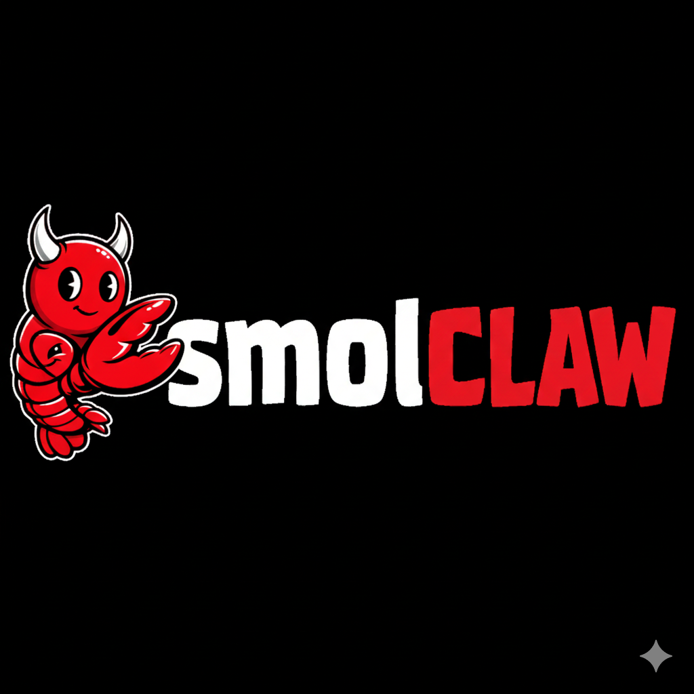

<div align="center" markdown="1">



# smolClaw

[OpenClaw][1] running on a microVM!

</div>

**smolClaw** is a [smolBSD][2] microVM appliance that runs
[OpenClaw][1] on Linux or macOS.

Running OpenClaw inside a microVM provides:

* Minimal footprint
* Strong isolation of memory and filesystem
* Fast startup (under one second)

As per the [smolBSD][2] design, the VM boots directly into a `tmux`
console with default bindings running `bash`.

# Quickstart

* Fetch [smolBSD][2] and install dependencies

```sh
$ git clone https://github.com/NetBSDfr/smolBSD
```
Debian, Ubuntu and the like
```sh
$ sudo apt install curl jq git bmake qemu-system-x86_64 sudo binutils libarchive-tools gdisk socat
```
macOS
```sh
$ brew install curl jq git bmake qemu binutils libarchive
```

* Build the OpenClaw image

```sh
$ cd smolBSD
$ ./docker2svc.sh dockerfiles/Dockerfile.clawd
```

* Run the microVM

```sh
$ ./startnb.sh -c 4 -m 3072 -f etc/clawd.conf
```

Options:

- `-c` → CPU cores
- `-m` → RAM in MB

To share a host directory:

```sh
./startnb.sh -c 4 -m 3072 -f etc/clawd.conf -w /path/to/directory
```

Inside the VM it will be mounted at:

```
/mnt
```

* Once the microVM has started, begin onboarding

```sh
clawd🦞 openclaw onboard --skip-daemon
```

* When onboarding is finished, press `Ctrl+C` and start the gateway

```sh
clawd🦞 openclaw gateway --bind lan --port 18789 --verbose
```

[1]: https://github.com/openclaw/openclaw
[2]: https://smolBSD.org
