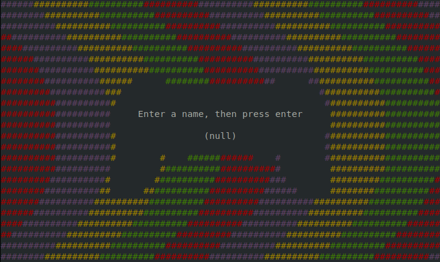
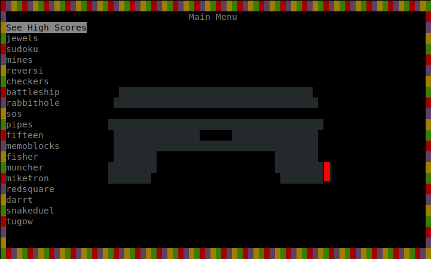

# games service 

Very useless service for [smolBSD](https://github.com/NetBSDfr/smolBSD) allowing to play text-based games.

*⚠ Be careful: don't use it at work except if your boss is a good guy and agree you play during job time. ;-)*

Do you want to spawn microvm in a sec to play ~~AAA~~ text-based games on *NetBSD* 🚩? It's now possible with this very amazing service! (I save your day, I know). It's a pack of 15 games with a lot of ~~3D-high-res-4k-textured polygones~~ text characters.

Launch it and enjoy these ~~latest top of the art from video game industry~~ old text-based games!


## Usage
Building on GNU/Linux or MacOS
```sh
$ bmake SERVICE=games build
```
Building on NetBSD
```sh
$ make SERVICE=games base
```
Edit `etc/games.conf` file as needed (example values in this files are a joke 🤡, leave it commented. Default smolBSD values will be used.), then, start the service:
```sh
./startnb.sh -f etc/games.conf
```



Enter your name for high scores records and `Enter`.



Choose your game with `up` and `down` arrows and press `Enter`. Many games quit with `q` and others with `Ctrl+c`.

Press `q` to quit this application and `Ctrl+a x` to quit and close the microvm.


## Note

This service install the `nbsdgames` package from NetBSD repo. The first launch is very slow due to this installation but the next will be very fast like smolBSD can do!

Games can run faster editing `etc/games.conf` file to put more cores et more memory.
(It's a joke 🤡)

Made with ❤.
